# Plans With You — Complete Master Specification

Generated from scratch: **2026/08/23 15:16 AEST (UTC+10) / 2026/08/23 05:16 UTC**

This document is the complete product, architecture, operation and acceptance specification. Current production identity and visual detail are authoritative in `src/brand/config.ts`, `src/brand/cadence.ts`, `DESIGN.md`, and `docs/24_BRAND_LOCK.md`; those sources supersede any legacy “Society” vocabulary retained here as conceptual domain language.

---

# 1. Product Constitution

## 1.1 Belonging without attendance

The Society exists to provide a meaningful sense of belonging, inclusion, continuity and personal attention without attendance pressure.

## 1.2 Ordinary club events are constructed and cancelled

An ordinary club event is a deliberately constructed piece of club theatre and correspondence. It is not a real attendance obligation. Its successful lifecycle includes cancellation.

## 1.3 Silence is valid membership

No engagement score, inactivity nag, posting requirement, activity streak, member leaderboard or participation quota.

## 1.4 Care is real

The club genuinely remembers and recognises members within boundaries they choose. Automation may deliver care but may not invent personal facts.

## 1.5 Consent controls optional intimacy

Post, gifts, calls, manufactured commitments and other higher-touch services require explicit permission.

## 1.6 Runtime authority

Cloudflare/D1 owns state. AI conversations do not.

## 1.7 AI is subordinate to policy

AI may generate, classify, extract, suggest and perform authorised tool actions. It may not override consent, budget, entitlements, legal gates, safety or state machines.

## 1.8 Human work is first-class

Physical and judgement-heavy work intentionally escalates to the human operator.

## 1.9 Every branch ends

Every workflow must explicitly reach success, cancellation, denial, failure, retry, escalation, deletion or closure. No silent permanent pending state.

## 1.10 Fiction must not become false representation of unrelated real parties

No fabricated venue partnership, sponsorship, booking or endorsement.

## 1.11 Privacy is part of the product

Member memory should feel like controlled institutional remembrance, not surveillance.

---

# 2. Product and Commercial Model

## 2.1 What is sold

The subscription buys an ongoing membership relationship. Members receive a club identity, correspondence, plausible social plans, cancellations, milestones and increasingly tangible/human treatment according to tier.

## 2.2 A$5/month — Member

Current intended inclusions:

- real membership record and member number;
- chapter/region;
- digital membership card;
- newsletter if enabled;
- ordinary event invitations;
- cancellations;
- personalised digital correspondence;
- birthday email;
- membership-anniversary email;
- member memory/personalisation;
- digital archive;
- ceremonial titles/milestones;
- occasional economical physical item where policy allows.

Gross recurring revenue before fees/costs: A$60/year.

The physical component must remain economically controlled.

## 2.3 A$20/month — Corresponding Member

Everything in A$5 plus materially more real-world fulfilment:

- physical welcome pack;
- physical membership card;
- good stationery;
- signed welcome letter;
- posted birthday card;
- anniversary letter/card;
- periodic signed correspondence;
- milestone artefacts;
- selected human review;
- occasional small club item;
- optional manufactured commitments.

Concept: **the club arrives in the letterbox**.

Gross recurring revenue before fees/costs: A$240/year.

## 2.4 A$50/month — Deluxe Member

Everything above plus:

- higher-quality welcome package;
- hand-signed personal correspondence;
- thoughtful gifts;
- birthday gift/treatment according to policy;
- anniversary gifts;
- opted-in calls;
- deeper operator involvement;
- premium manufactured commitments;
- priority handling;
- more substantial limited artefacts;
- more genuine continuity with the people behind the club.

Gross recurring revenue before fees/costs: A$600/year.

A$50 is not unlimited human labour.

## 2.5 Tier philosophy

All tiers are genuine members. Higher tiers buy more expensive delivery and human time, not more emotional worth.

## 2.6 Real-world Society representative / actor service

A separately priced adjacent service may be available to members and non-members.

Possible harmless roles:

- friend;
- plus-one;
- Society representative;
- guest;
- supporter;
- fictional non-specific old colleague;
- ceremonial club representative.

The customer understands the arrangement.

Travel model:

- local where practical;
- interstate/international possible;
- labour + flights + accommodation + transport + expenses quoted separately.

Members may receive better rates, priority or richer preparation.

Do not lock public pricing without approval.

## 2.7 Manufactured commitments

Optional for entitled members.

Example:

```text
Member wants apartment cleaned
→ member requests constructed visitor scenario
→ Society proposes scenario
→ member explicitly confirms
→ reminders create useful pressure
→ member knows it is artificial
→ Society cancels at agreed point
→ scenario closes
```

The member may abort at any time.

## 2.8 Milestones

Potential triggers:

- join;
- 3 months;
- 6 months;
- 1 year;
- annual anniversary;
- 3 years;
- 5 years;
- 10 years;
- birthday;
- special Society anniversary;
- selected member-provided life milestone.

Policies are data-driven.

## 2.9 Physical artefacts

Possible:

- membership card;
- printed welcome letter;
- seal/sticker;
- certificate;
- quality pen;
- pin;
- medallion;
- stationery;
- anniversary card;
- numbered limited object.

Avoid cheap promotional junk.

## 2.10 Long-term relationship value

The service compounds through history:

- prior letters;
- prior calls;
- remembered jokes;
- prior gifts;
- milestones;
- tenure;
- event/cancellation history.

Five years of history is a meaningful relationship asset.

---

# 3. Member Onboarding, Alignment, Preferences and Consent

## 3.1 Paid activation rule

Conceptually:

```text
ACTIVE =
  identity_complete
  AND chapter_resolved
  AND tier_selected
  AND preferences_complete
  AND services_selected
  AND alignment_acknowledged
  AND required_consents_current
  AND required_terms_current
  AND billing_active
```

Waiting-list release has a separate waitlist state and does not create fake paid active membership.

## 3.2 Identity

Required initially:

- email;
- first name/preferred first name;
- country;
- metro/chapter area.

Optional:

- surname;
- preferred/correspondence name;
- Society alias/codename;
- birthday;
- postal address where services require it.

## 3.3 Why are you joining?

Multi-select alignment form can include:

- I enjoy having plans cancelled.
- I want to feel included without attendance pressure.
- I want proper correspondence.
- I want the Society to remember me.
- I want physical mail.
- I want occasional human contact.
- I want accountability/manufactured commitments.
- I like gifts and surprises.
- I may use a Society representative service.
- I mostly think this is funny.

Optional free text.

## 3.4 Ordinary event preferences

### Frequency

Candidate presets, exact policy not yet final:

- occasional;
- approximately monthly;
- a couple per month;
- Society discretion.

### Types

- dinners;
- gallery/museum;
- theatre;
- music;
- walks;
- talks;
- formal;
- casual;
- cultural;
- unusual Society function;
- surprise me.

### Timing

- weekdays;
- Friday;
- weekends;
- daytime;
- evening;
- broad.

### Geography

- chapter;
- preferred areas;
- areas to avoid;
- plausible fictional travel radius.

### Cancellation personality

Candidate modes:

- Merciful;
- Traditional;
- Last Minute;
- Society discretion.

Exact time windows require user approval.

## 3.5 Communication preferences

Model independently:

```text
EMAIL_OPERATIONAL
NEWSLETTER
PERSONAL_EMAIL
CALENDAR_MESSAGES
POSTAL_CORRESPONDENCE
BIRTHDAY_POST
CALLS
GIFTS
SURPRISE_GIFTS
```

Newsletter opt-out must not block essential operational cancellation email.

## 3.6 Member memory

Explain clearly that the Society can remember information the member chooses to provide so future correspondence has continuity.

Possible categories:

- hobbies;
- interests;
- pets;
- projects;
- voluntarily supplied work milestones;
- favourite things;
- voluntarily supplied family details;
- important dates;
- running jokes;
- previous gifts;
- correspondence context.

Provide:

- **Things the Society should know about me**
- **Things the Society should never mention**

## 3.7 Physical correspondence

States:

```text
INELIGIBLE
AVAILABLE
OPTED_IN
WAIVED_BY_MEMBER
PAUSED
```

If opted in, capture:

- postal address;
- postal name;
- cards allowed;
- letters allowed;
- packages allowed;
- surprise packages allowed.

A member can waive physical fulfilment without blocking core membership.

## 3.8 Gifts

Where available:

- enabled/disabled;
- surprises enabled/disabled;
- ask first;
- club artefacts only;
- exclusions;
- interests;
- never-send notes.

## 3.9 Calls

Explicit opt-in only.

Possible modes:

```text
NO_CALLS
BIRTHDAY_CALLS
MILESTONE_CALLS
OCCASIONAL_CLUB_CALLS
ALL_ALLOWED
```

Also store:

- preferred days;
- time windows;
- timezone;
- voicemail permission;
- surprise call permission;
- contact-first preference.

Tier entitlement never overrides member opt-out.

## 3.10 Manufactured commitments

Membership-level opt-in only means the service may be offered.

Every actual scenario requires separate confirmation.

The member acknowledges:

- scenario is constructed;
- fictional names may be used;
- nobody is really travelling unless separately booked;
- member can abort;
- Society will explicitly terminate scenario.

## 3.11 Appearance-service interest

Onboarding may record:

```text
INTERESTED
NOT_INTERESTED
ASK_LATER
```

This is not a booking or blanket agreement.

## 3.12 Plain-language expectations gate

Before paid activation, state clearly:

- ordinary Society events are constructed;
- ordinary Society events are intended to be cancelled;
- members are not expected to attend;
- Society characters/attendees may be fictional;
- real locations do not imply partnership;
- AI/automation may assist authorised personalisation;
- human operators perform selected real-world tasks;
- optional services remain controllable.

Require explicit acknowledgement.

## 3.13 Versioned legal documents

Do not store merely `terms_accepted=true`.

Suggested types:

```text
MEMBERSHIP_TERMS
PRIVACY_POLICY
THEATRICAL_EXPERIENCE_ACKNOWLEDGEMENT
PERSONALISATION_CONSENT
PHYSICAL_FULFILMENT_CONSENT
CALL_CONSENT
MANUFACTURED_COMMITMENT_TERMS
APPEARANCE_SERVICE_TERMS
```

Store exact document version, effective date, content hash, acceptance time and method.

## 3.14 Reconsent

A material optional-service terms change should normally pause only that service.

Example:

```text
CORE_MEMBERSHIP = ACTIVE
CALLS = PAUSED_PENDING_RECONSENT
```

## 3.15 Permission revocation

Revocation affects future scheduled work.

Example:

```text
birthday call already scheduled
→ member disables calls
→ future call task cancelled
→ audit reason MEMBER_OPTED_OUT
→ other birthday actions continue
```

---

# 4. Brand, Naming, Copy and SEO

## 4.1 Domain

Locked:

`https://club.loftwah.com`

## 4.2 Public name

Not final. Agent must not silently lock one.

## 4.3 Naming criteria

A strong name should:

- sound like a legitimate institution;
- work on stationery;
- work spoken aloud;
- support lore;
- not explain the joke instantly;
- not require members to self-identify as introverts;
- have manageable business/trademark/SEO collision;
- support a dedicated domain later if desired.

## 4.4 Existing candidate names

- The Deferred Society
- The Society of Considered Absence
- The Absent Society
- The Quiet Assembly
- The Unattended Society
- The Society of Cancelled Engagements
- The Last-Minute Society
- The Society for Regrettable Commitments

Naming phase should generate at least 20 total candidates and shortlist 3–5 for user approval with rationale, likely collision, domain options, crest potential and tone.

## 4.5 Optional member Society alias

Keep separate from billing/legal identity:

```text
preferred_name
postal_name
society_alias
```

## 4.6 Identity system

Need:

- wordmark;
- monogram;
- seal/crest;
- favicon;
- palette;
- typography;
- stationery;
- envelope;
- membership card;
- invitation;
- cancellation notice;
- certificate;
- pin/medallion;
- email visual language;
- social imagery.

## 4.7 Visual tone

Desired:

- premium;
- editorial;
- institutional;
- tactile;
- serious;
- restrained;
- warm;
- slightly mysterious;
- dry.

Avoid generic AI gradients, meme styling, cheap merch aesthetic and generic SaaS public-page design.

## 4.8 ThreeUI

ThreeUI means the current project by Meng To / Design+Code.

Current verified official Community repo:

`https://github.com/MengTo/threeui`

Current verified public React package:

```text
@designcodeio/threeui
```

Current documented install:

```sh
npm install @designcodeio/threeui
```

Use ThreeUI intentionally for premium 3D enhancement, not as a replacement for semantic site content.

Possible uses:

- hero;
- embossed seal;
- membership card;
- envelopes/correspondence;
- pins/medallions;
- archival objects;
- motion atmosphere.

## 4.9 SEO/ThreeUI invariant

Critical content remains semantic DOM HTML and must work when:

- WebGL unavailable;
- JavaScript delayed;
- reduced motion enabled;
- mobile GPU weak.

Do not hide headings, value proposition, pricing, FAQ, chapter content, waiting-list form or legal links inside canvas-only UI.

## 4.10 MiniMax visual generation

MiniMax may generate:

- campaign and social asset explorations;
- fictional archival portraits;
- event art;
- stationery mockups;
- physical artefact mockups;
- social imagery.

Record prompt/provider/model/date for selected assets.

## 4.11 Copy proposition

Locked public name and tagline:

> Plans With You

> You are wanted. You don't have to go.

The narrative proposition “Plans were made. Plans were unmade.” may support the tagline. Production copy follows `src/brand/config.ts` and does not self-identify as “the Society” or “the Club”.

## 4.12 Public information architecture

Suggested:

```text
/
/membership
/how-it-works
/about
/chapters
/chapters/melbourne
/chapters/sydney
/chapters/brisbane
/chapters/adelaide
/chapters/perth
/events
/events/archive
/journal
/correspondence
/membership-artifacts
/waiting-list
/faq
/privacy
/terms
```

Only create chapter pages with adequate real content.

## 4.13 SEO themes

- social club for introverts;
- low-pressure social club;
- club without attendance pressure;
- belonging without participation;
- cancelled plans;
- social membership;
- introvert events Melbourne;
- quiet social club;
- social activities without commitment.

Use natural editorial copy, not keyword stuffing.

## 4.14 Structured-data integrity

Do not use public `Event` schema to falsely tell search engines a constructed non-public event is genuinely happening.

## 4.15 Homepage structure

1. premium hero;
2. concise proposition;
3. live cancelled-event counter;
4. how it works;
5. sample invitation → cancellation;
6. tier preview;
7. physical artefacts;
8. personal attention/birthday;
9. chapters;
10. lore/journal;
11. FAQ;
12. waiting-list CTA.

## 4.16 Voice

Precise, dry, formal-ish, warm and confident.

Avoid “engage with the community”, inactivity nagging, fake urgency and jokes in every sentence.

## 4.17 Journal/newsletter

Institutional publication rather than company blog:

- chapter reports;
- upcoming constructed engagements;
- cancellations;
- archive pieces;
- correspondence extracts;
- Society history;
- etiquette;
- seasonal letters;
- artefact announcements.

---

# 5. System Architecture — C4

## 5.1 Architectural rule

> Humans and AI are actors. Cloudflare is the system of record. APIs define capabilities. MCP exposes selected capabilities safely to agents. Queues represent durable work. Cron represents time. Resend represents correspondence. No actor is trusted to remember state that belongs to the system.

## 5.2 C4 Level 1 — System Context

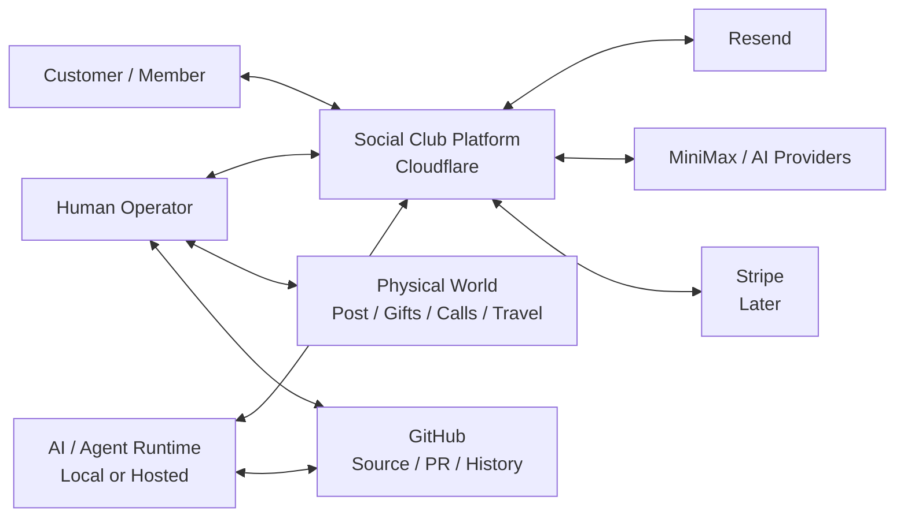

## 5.3 C4 Level 2 — Containers

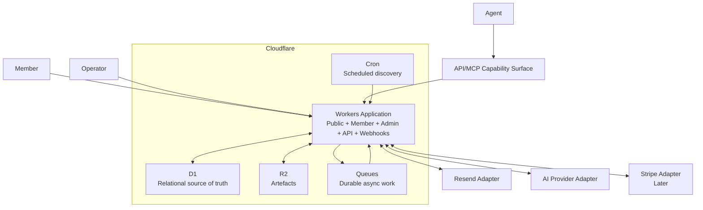

## 5.4 Modular monolith

Start with one coherent deployable Workers application exposing fetch/web routes, API/MCP, webhooks, queue consumer and scheduled handler where supported by chosen framework/entry architecture.

Do not start with a swarm of microservices.

## 5.5 C4 Level 3 — Logical Components

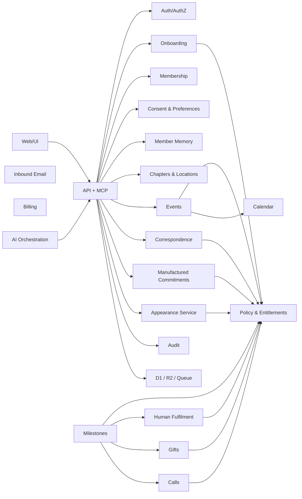

## 5.6 Worker responsibilities

- public site;
- waiting list;
- member portal;
- admin;
- API/MCP;
- Resend webhook;
- Stripe webhook later;
- queue handlers;
- scheduled handler;
- protected artefact delivery.

## 5.7 D1

Canonical relational source of business truth.

## 5.8 R2

Stores:

- images;
- letters;
- PDFs;
- cards;
- certificates;
- public brand assets;
- private member artefacts.

Private artefacts require authorised access, not permanent world-readable URLs.

## 5.9 Queues

Logical jobs:

```text
GENERATE_TEXT
GENERATE_IMAGE
RENDER_ARTIFACT
SEND_EMAIL
PROCESS_INBOUND_EMAIL
CREATE_MILESTONE_ACTIONS
CREATE_HUMAN_TASK
RESEARCH_LOCATION
EVENT_HEALTH_CHECK
AI_AGENT_WORK
```

All side-effecting jobs need idempotency.

## 5.10 Cron

Cron discovers due work and enqueues bounded jobs. It does not synchronously perform huge AI/email batches.

## 5.11 Environment model

Do not add `APP_ENV`.

Local, preview and production differ through real URLs, bindings, credentials and provider modes.

## 5.12 Local development

Cloudflare current documentation supports local Worker execution via `workerd`/Miniflare and local simulations for D1, R2 and Queues. Use them for integration/acceptance tests.

## 5.13 Public canonical URL

`https://club.loftwah.com`

Needed for generated absolute links from queues/Cron that have no incoming HTTP origin.

## 5.14 GitHub role

Source, specification, issues, PRs, history, release tags and minimal independent verification. Not part of customer runtime.

---

# 6. Data Model and ERD

## 6.1 Conceptual ERD

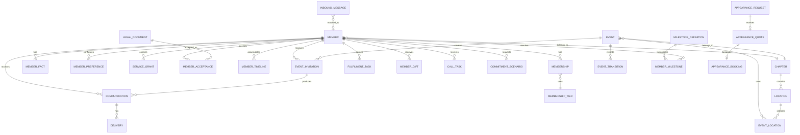

## 6.2 Suggested table groups

### Acquisition

```text
waitlist_entries
referrals
```

### Membership

```text
members
member_profiles
member_addresses
memberships
membership_tiers
member_preferences
member_service_grants
member_timeline
```

### Legal/consent

```text
legal_documents
member_acceptances
consent_events
```

### Member memory

```text
member_facts
member_fact_candidates
member_fact_restrictions
```

### Geography

```text
chapters
regions
locations
location_tags
location_verifications
```

### Events

```text
events
event_locations
event_invitations
event_transitions
event_calendar_messages
```

### Communications

```text
communications
communication_deliveries
inbound_messages
inbound_attachments
communication_templates
```

### Milestones/fulfilment

```text
milestone_definitions
member_milestones
fulfilment_tasks
physical_artifacts
gifts
member_gifts
calls
```

### Optional services

```text
commitment_scenarios
appearance_requests
appearance_quotes
appearance_bookings
```

### Billing

```text
billing_customers
subscriptions
payments
refunds
billing_events
```

### Fictional institution

```text
fictional_people
club_lore
club_history
journal_articles
```

### System

```text
ai_generations
jobs
idempotency_records
audit_log
system_events
```

## 6.3 Member facts

Conceptual fields:

```text
id
member_id
category
subject
value_json
status
source_type
source_id
confidence
do_not_use
created_at
updated_at
```

Statuses:

```text
CANDIDATE
CONFIRMED
REJECTED
REVOKED
```

AI may propose candidates. Confirmed truth follows deterministic source/confirmation policy.

## 6.4 Service grants

```text
CORE_MEMBERSHIP
NEWSLETTER
PERSONALISED_MEMORY
CALENDAR_MESSAGES
PHYSICAL_CORRESPONDENCE
GIFTS
CALLS
MANUFACTURED_COMMITMENTS
APPEARANCE_INTEREST
```

States:

```text
AVAILABLE
OPTED_IN
OPTED_OUT
INELIGIBLE
PAUSED
SUSPENDED
```

## 6.5 Entitlements

Do not hard-code price checks. Use capability mapping.

Capabilities can include:

```text
EVENTS
NEWSLETTER
MEMBER_MEMORY
DIGITAL_BIRTHDAY
PHYSICAL_WELCOME
PHYSICAL_CORRESPONDENCE
MILESTONE_ARTEFACT
MANUFACTURED_COMMITMENTS
GIFTS
CALLS
PREMIUM_HUMAN_ATTENTION
APPEARANCE_MEMBER_BENEFIT
```

## 6.6 Event fields

At minimum:

```text
id
chapter_id
title
event_type
start_at
duration_minutes
cancellation_due_at
state
created_by_actor
created_at
updated_at
cancelled_at
archived_at
```

## 6.7 Jobs

```text
job_id
type
entity_type
entity_id
payload_version
priority
attempt
idempotency_key
available_at
claimed_until
created_at
completed_at
failure_reason
```

## 6.8 Audit

```text
id
actor_type
actor_id
action
entity_type
entity_id
from_state
to_state
reason_code
correlation_id
metadata_json
created_at
```

## 6.9 Fictional vs real

Fictional Society characters/lore must be explicitly stored/labelled as fictional institutional content, not inserted into real member tables.

---

# 7. State Machines

## 7.1 Waitlist

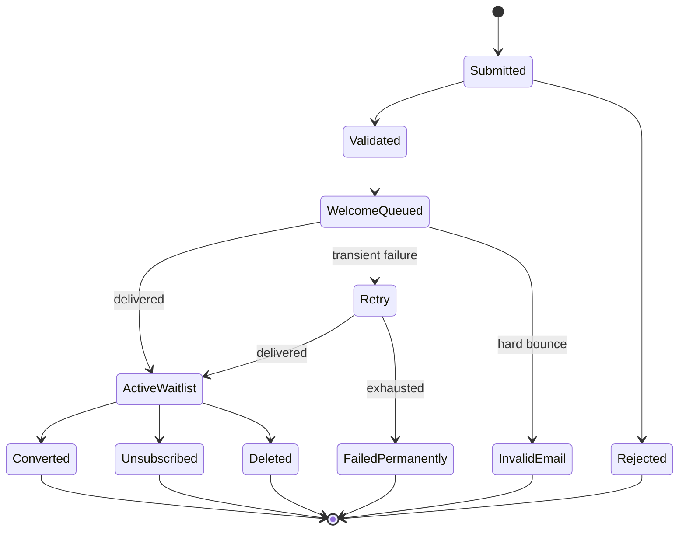

## 7.2 Paid onboarding

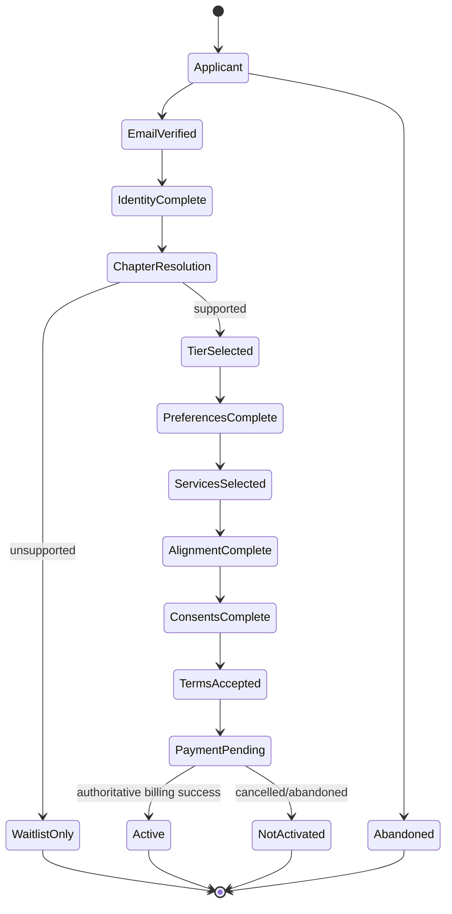

## 7.3 Membership standing

```text
ACTIVE
→ PAST_DUE → ACTIVE | CANCELLED
ACTIVE → CANCELLED
CANCELLED → ACTIVE on rejoin
ACTIVE → SUSPENDED → ACTIVE
```

Deletion is separate.

## 7.4 Ordinary event

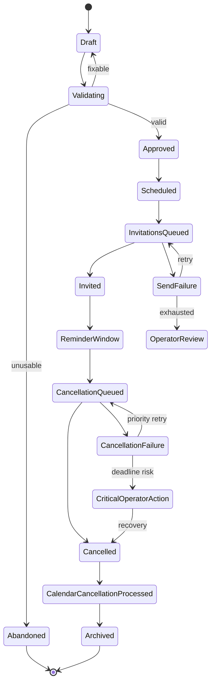

Forbidden ordinary-event states:

```text
ATTENDED
CHECKED_IN
NO_SHOW
```

## 7.5 Communication

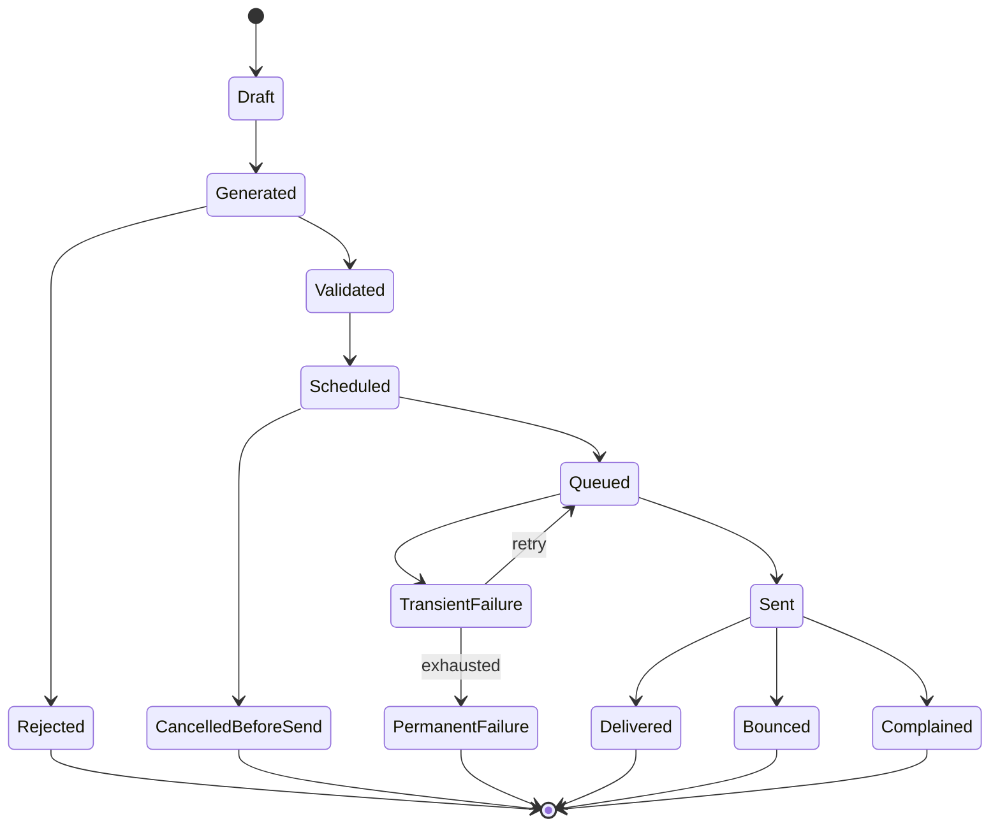

## 7.6 Inbound email

```text
RECEIVED
→ SIGNATURE_VERIFIED
→ STORED
→ MATCHED | UNMATCHED
→ CLASSIFIED
→ AUTO_HANDLED | HUMAN_REVIEW | SAFE_NO_ACTION
→ CLOSED
```

Failures:

```text
INVALID_SIGNATURE → REJECTED
DUPLICATE → ACKNOWLEDGED_NOOP
MALFORMED → QUARANTINED/REJECTED
PROCESSING_FAILURE → RETRY → HUMAN_REVIEW/PERMANENT_FAILURE
```

## 7.7 Human fulfilment

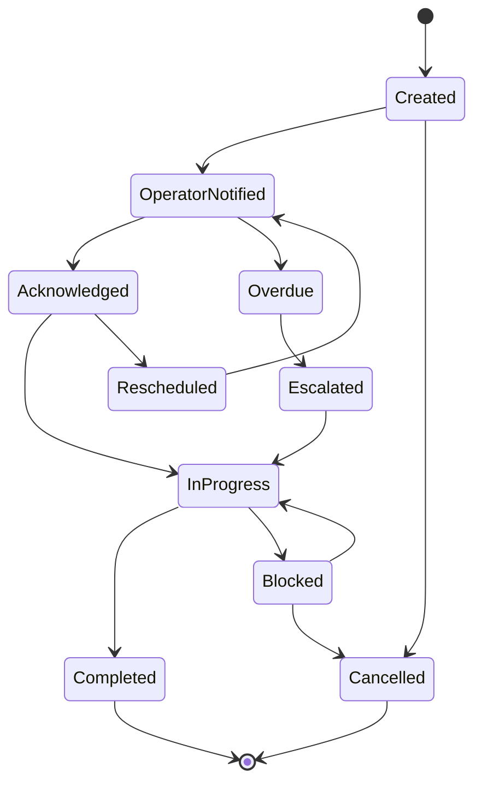

## 7.8 Gift

```text
TRIGGERED
→ ELIGIBILITY_CHECK
  → NOT_ELIGIBLE → CLOSED
  → MEMBER_OPTED_OUT → CLOSED
  → BUDGET_DENIED → ALTERNATIVE/CLOSED
  → ELIGIBLE
→ SUGGESTED
→ HUMAN_APPROVED
→ PURCHASED
→ DISPATCHED
→ DELIVERED
```

Exceptions terminate through retry, alternative, replacement or closure.

## 7.9 Call

```text
PROPOSED
→ POLICY_ALLOWED | DENIED
→ SCHEDULED
→ DUE
→ COMPLETED
```

Branches:

```text
PERMISSION_REVOKED → CANCELLED
MEMBER_CANCELLED → CANCELLED
NO_ANSWER → RESCHEDULED/CLOSED according to policy
```

## 7.10 Manufactured commitment

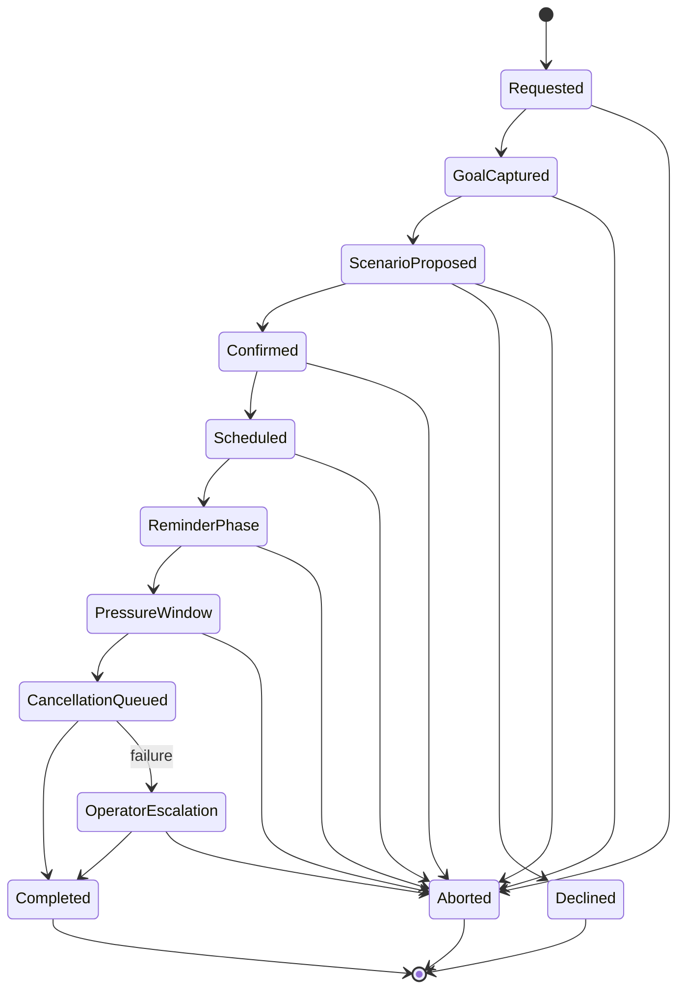

## 7.11 Appearance service

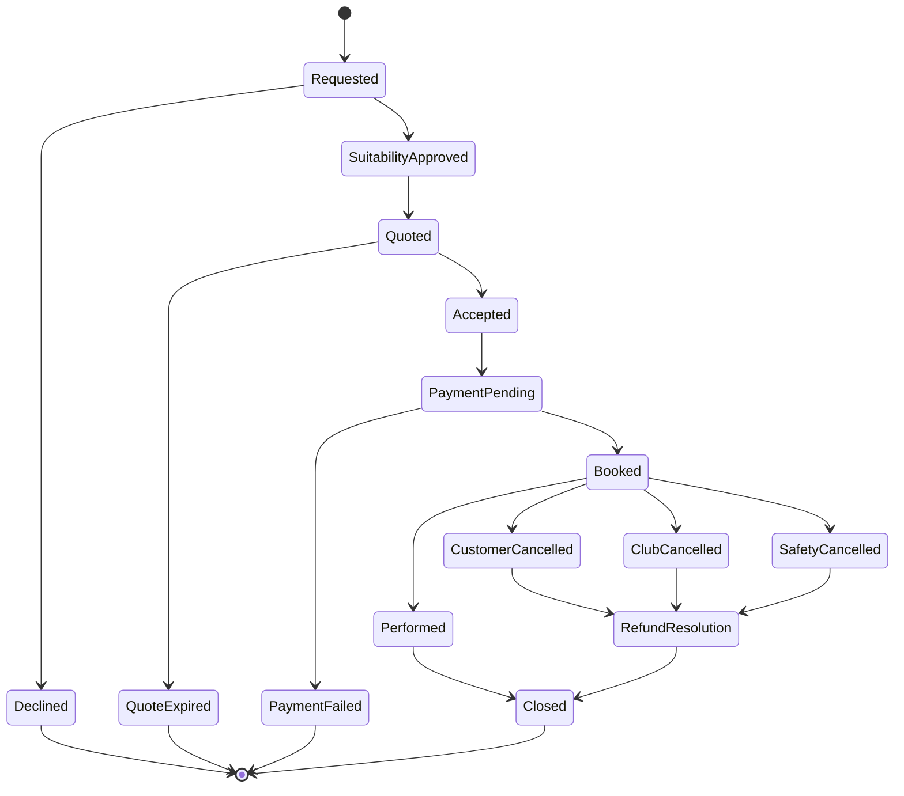

## 7.12 Deletion

```text
REQUESTED
→ ACTIVITY_SUSPENDED
→ FUTURE_JOBS_CANCELLED
→ PERSONAL_DATA_DELETION
→ REQUIRED_RETENTION_SEPARATED
→ DELETED
```

## 7.13 State-machine test rule

Every state must have a documented outgoing path unless terminal. Every failure must retry, close or escalate. Invalid transitions are tested.

---

# 8. Functions and Mechanisms

## 8.1 Central policy engine

Concept:

```ts
type PolicyDecision = {
  allowed: boolean
  reason: string
  evidence: string[]
}

canPerform(memberId, capability, context): PolicyDecision
```

Inputs:

- membership state;
- tier entitlement;
- service grant;
- explicit preference;
- current consent;
- prerequisites;
- budget;
- safety rule;
- state transition;
- idempotency/duplicate status.

AI cannot override this result.

## 8.2 Entitlements

Bad:

```ts
if (price === 50) enableCalls();
```

Good:

```text
entitlement(tier_id, CALLS)
```

## 8.3 Activation evaluator pseudocode

```text
evaluateActivation(application):
  if unsupported chapter:
      return WAITLIST_ONLY

  blockers = missing identity/tier/preferences/alignment/consent/terms/payment

  if blockers:
      return ONBOARDING_INCOMPLETE(blockers)

  return READY_TO_ACTIVATE
```

## 8.4 Scheduled work

```text
scheduled(now):
  page birthdays due
  page anniversaries due
  page invitations due
  page reminders due
  page cancellations due
  page event safety checks
  page overdue fulfilment
  page chapter maintenance
  enqueue bounded jobs
```

## 8.5 Job envelope

```text
job_id
type
entity
payload_version
attempt
idempotency_key
priority
available_at
```

## 8.6 Member context

```text
buildMemberContext(member, purpose):
  minimum identity
  relevant preferences
  permitted confirmed facts
  restrictions/do-not-mention
  small relevant timeline slice
  prior related correspondence if needed
  no unrelated members
```

## 8.7 Location knowledge base

Store:

- canonical name;
- chapter;
- suburb/area;
- address where appropriate;
- source/URL;
- type;
- tags;
- verification date;
- status.

Status:

```text
ACTIVE
REVERIFY_DUE
STALE
RETIRED
```

Event generation cannot use retired locations.

## 8.8 Location research

```text
AI discovers candidate
→ verify source/status/address
→ normalise
→ tag
→ review/confidence
→ ACTIVE
```

Do not let a model hallucinate local geography as durable truth.

## 8.9 Event proposal

Inputs:

- chapter;
- approved locations;
- member preference cohort;
- season/date range;
- recent event history;
- diversity rules;
- brand voice.

Structured output example:

```json
{
  "title": "...",
  "chapterId": "...",
  "eventType": "gallery",
  "startAt": "...",
  "durationMinutes": 120,
  "cancellationDueAt": "...",
  "locationIds": ["..."],
  "description": "...",
  "dressGuidance": null,
  "claims": []
}
```

Validate locations, dates, cancellation safety, geography, claims, schema and no attendance requirement.

Invalid output retries a bounded number, then human review or abandon.

## 8.10 Invitation

```text
scheduled event
→ eligible members
→ preference/policy check
→ invitation record
→ correspondence
→ calendar payload if opted in
→ queue send
```

No RSVP required.

## 8.11 Cancellation

```text
cancellation due
→ validate state
→ CANCELLATION_QUEUED
→ generate or choose deterministic content
→ validate
→ queue email/calendar cancellation
→ CANCELLED at defined authoritative point
→ record recipient outcomes
→ update derived metrics
→ archive later
```

## 8.12 Cancellation does not depend on AI

If MiniMax unavailable, use deterministic safe cancellation content. Core cancellation must continue.

## 8.13 Event safety monitor

```text
for events inside emergency window:
  if not safely cancelled:
      mark CRITICAL
      enqueue priority cancellation
      notify human operator
```

## 8.14 Public cancellation counter

Derived from real D1 records. Cache allowed only if rebuildable.

Estimated attendance hours avoided can be:

```text
SUM(event duration × real invited member count)
```

Label as estimate.

## 8.15 Birthday

```text
birthday due
→ idempotent milestone
→ policy per tier/preferences
→ independent actions
```

A$5: digital.

A$20: digital + physical task if permitted.

A$50: digital + physical + gift eligibility + call eligibility.

One failed channel must not erase the whole milestone.

## 8.16 Human fulfilment

```text
create task
→ render artefact
→ store private R2
→ operator email/admin
→ acknowledge
→ complete/reschedule/block/cancel
→ audit
→ member timeline
```

Completion is idempotent.

## 8.17 Gift

```text
occasion
→ entitlement
→ member permission
→ exclusions
→ budget
→ history
→ AI suggestions
→ human approval
→ purchase
→ dispatch
→ outcome
```

AI should not independently make expensive purchases.

## 8.18 Call briefing

Include only:

- member identity;
- tenure;
- purpose;
- relevant confirmed facts;
- related prior contact;
- do-not-mention;
- allowed time window.

## 8.19 Member fact extraction

Example:

> I got a new dog called Frank.

AI may propose:

```text
category=pet
subject=Frank
value=dog
source=inbound message
```

Do not infer breed/age.

Whether simple explicit verified-member statements auto-confirm is deterministic policy, not model judgement.

## 8.20 Correspondence validation

Before send validate:

- allowed facts;
- do-not-mention;
- correct member/event;
- no fake partnership;
- channel permission;
- legal/footer requirements;
- no attendance implication.

## 8.21 Manufactured commitment mechanism

```text
request
→ goal
→ proposed scenario
→ explicit confirm
→ schedule reminders
→ pressure window
→ cancellation/closure
→ clear all future jobs
→ COMPLETED
```

Abort stops future work and closes scenario.

Automatic closure failure creates critical human task.

## 8.22 Appearance service mechanism

```text
request
→ suitability
→ role/boundaries
→ location/travel
→ quote
→ acceptance
→ payment
→ briefing
→ perform/cancel
→ closure/refund
```

## 8.23 Deletion

Immediately suspend future personalisation/communications before asynchronous deletion proceeds.

## 8.24 Operator digest

Include:

- birthdays;
- anniversaries;
- letters/cards;
- gifts;
- calls;
- appearance enquiries;
- inbound review;
- critical failures;
- overdue work.

If none: **No intervention required.**

## 8.25 Agent work lease

```text
AVAILABLE
→ CLAIMED until expiry
→ COMPLETED | FAILED
```

Agent disappears → lease expires → job available again.

---

# 9. Resend, Email and Calendar

## 9.1 Correct current environment names

```text
RESEND_API_KEY
RESEND_WEBHOOK_ID
RESEND_WEBHOOK_SIGNING_SECRET
RESEND_FROM
OPERATOR_EMAIL
```

Do not use `RESEND_WEBHOOK_SECRET`.

## 9.2 Locked webhook

```text
POST https://club.loftwah.com/api/webhooks/resend
```

Initial event:

```text
email.received
```

## 9.3 Verified current Resend facts

Current Resend documentation verifies:

- webhook-management API exists;
- create returns webhook `id`;
- create returns `signing_secret`;
- signing secret is `whsec_...`;
- verification uses raw request body;
- current verification example uses `svix-id`, `svix-timestamp`, `svix-signature` headers;
- inbound mail uses `email.received`.

Re-check official docs at implementation time.

## 9.4 Webhook creation command

Only if no webhook exists:

```bash
curl -sS https://api.resend.com/webhooks \
  -H "Authorization: Bearer $RESEND_API_KEY" \
  -H "Content-Type: application/json" \
  -d '{
    "endpoint": "https://club.loftwah.com/api/webhooks/resend",
    "events": ["email.received"]
  }'
```

Expected response includes:

```json
{
  "object": "webhook",
  "id": "...",
  "signing_secret": "whsec_..."
}
```

Store returned values as:

```text
RESEND_WEBHOOK_ID
RESEND_WEBHOOK_SIGNING_SECRET
```

The current project reports the real environment already has both values. Do not blindly create a duplicate webhook.

## 9.5 Verification pseudocode

Verify current SDK before coding exact syntax:

```text
rawBody = request raw text
headers = svix-id + svix-timestamp + svix-signature
verified = Resend verify(rawBody, headers, RESEND_WEBHOOK_SIGNING_SECRET)
invalid → 400, no business processing
```

Do not parse/re-serialise before signature verification.

## 9.6 Inbound sequence

The `email.received` webhook is **metadata only**. It does not contain the email body, headers or attachment bytes. The Worker must verify the raw body, persist the metadata, then call the Resend Received Emails API by `email_id` to obtain the message body and headers, and the Attachments API to obtain attachment metadata and bytes when needed.

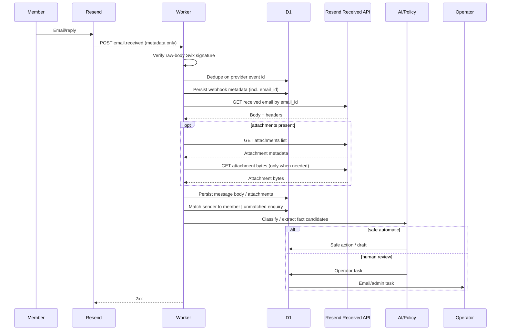

Inbound endpoints used (verify current Resend SDK shape at implementation time):

- `resend.emails.receiving.get(email_id)` — body and headers for a received message
- `resend.emails.receiving.attachments.list({ emailId })` — list of attachment metadata
- `resend.emails.receiving.attachments.get({ emailId, attachmentId })` — attachment bytes (only when actually required)

The body fetch is idempotent; results are cached/persisted in D1 keyed by `email_id` and (if available) provider-side `received_at` so re-processing the same `email_id` does not re-classify indefinitely.

## 9.7 Inbound address/domain

Receiving address is separate from webhook verification.

Resend provides a managed inbound address (`<alias>@<id>.resend.app`) that requires no DNS for development. A custom receiving domain requires DNS/MX setup.

Default development strategy: use the managed Resend inbound address while integrating. Migrate to a dedicated subdomain such as `inbound.club.loftwah.com` (single MX record on the `inbound` host at priority 10) only when real inbound traffic is needed.

Do not alter root `loftwah.com` MX records without explicit instruction. A receiving subdomain on `club.loftwah.com` is acceptable; touching the apex `loftwah.com` zone is not.

## 9.8 Outbound sequence

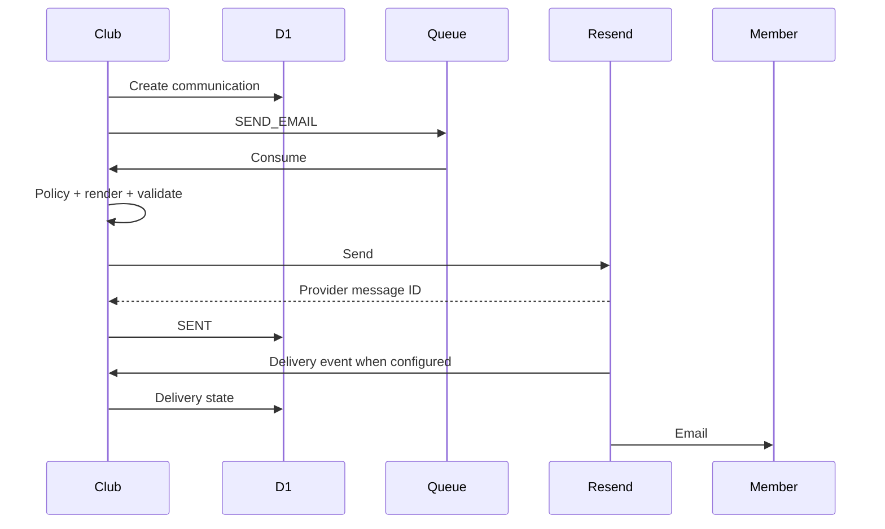

## 9.9 Email classes

```text
WAITLIST_WELCOME
MEMBERSHIP_WELCOME
MEMBERSHIP_ANNIVERSARY
EVENT_INVITATION
EVENT_REMINDER
EVENT_CANCELLATION
BIRTHDAY
PERSONAL_CORRESPONDENCE
CHAPTER_LETTER
NEWSLETTER
FULFILMENT_NOTIFICATION
ADMIN_TASK
ADMIN_ESCALATION
BILLING
PRIVACY
```

## 9.10 Calendar

MVP uses standards-based calendar messages/attachments, not member OAuth.

Every event has stable UID, conceptually:

```text
event-<uuid>@club.loftwah.com
```

Invitation and cancellation must use standards-compliant semantics and same UID.

Verify iCalendar specifics at implementation time and test actual Apple Calendar, Google Calendar and Outlook behaviour.

## 9.11 Email failure

Transient → retry.

Permanent → operator visibility.

Cancellation close to deadline → critical priority/escalation.

Calendar failure must not prevent plain email cancellation.

Official Resend references:

- https://resend.com/changelog/managing-webhooks-via-api
- https://resend.com/features/inbound
- https://resend.com/blog/inbound-emails

---

# 10. AI, MiniMax, API and MCP

## 10.1 Two AI planes

### Runtime AI

Bounded calls from deterministic workflows:

- event copy;
- cancellation copy;
- letters;
- birthday copy;
- image generation;
- inbound classification;
- candidate fact extraction.

### Autonomous agent AI

Local/hosted larger work:

- chapter research;
- location curation;
- operations review;
- monthly event preparation;
- content/SEO work;
- repository development.

## 10.2 MiniMax

Initial provider for text/images and agent work where suitable.

`MINIMAX_API_KEY` exists in project environment.

Provider abstraction is mandatory because MiniMax model names and capabilities evolve.

## 10.3 Runtime pattern

```text
deterministic system decides WHAT is required
→ AI generates/suggests HOW it should read/look
→ validator
→ domain action
```

Not:

```text
AI wakes up and invents business state
```

## 10.4 Safe MCP capabilities

### Member reads

```text
club.get_member_context
club.get_member_preferences
club.get_member_timeline
club.get_member_service_grants
```

### Operations

```text
club.get_daily_operations
club.list_due_milestones
club.list_operator_tasks
club.get_system_health
```

### Events

```text
club.propose_event
club.validate_event
club.schedule_event
club.cancel_event
```

### Correspondence

```text
club.draft_correspondence
club.validate_correspondence
club.queue_correspondence
```

### Memory

```text
club.propose_member_fact
club.list_member_fact_candidates
```

### Geography

```text
club.list_locations
club.propose_location_candidate
```

### Human tasks

```text
club.create_operator_task
```

## 10.5 Do not expose

```text
execute_arbitrary_sql
dump_all_members
write_unvalidated_member_record
send_unvalidated_email
```

## 10.6 Capability levels

- read;
- draft/proposal;
- operational write;
- restricted.

Restricted actions include refunds, deletion, expensive purchases, sensitive facts and appearance approval.

## 10.7 AI output schemas

Use structured outputs where logic depends on result.

Example correspondence:

```text
subject
preview
body
memberFactIdsUsed[]
claims[]
```

## 10.8 Validation

Reject output if:

- invented member fact;
- do-not-mention;
- fake partnership;
- wrong member/event;
- unsupported location;
- attendance instruction;
- malformed schema;
- unsafe request.

## 10.9 Prompt/version provenance

Record:

- prompt ID/version;
- provider/model;
- generation ID;
- fact IDs;
- validation result;
- final action.

## 10.10 Context minimisation

Give models only task-relevant member data. Never broad unrelated member access.

## 10.11 Prompt injection

Member-provided text is data. Tools and scoped context prevent cross-member access.

## 10.12 AI outage

Critical cancellation degrades to deterministic safe content. AI outage must not leave events active.

## 10.13 Current MiniMax references

- https://www.minimax.io/models/text
- https://platform.minimax.io/docs/api-reference/api-overview
- https://platform.minimax.io/docs/guides/text-generation

---

# 11. Human Operator Runtime

## 11.1 Task types

```text
PRINT_AND_SIGN
POST_ITEM
SELECT_GIFT
PURCHASE_GIFT
MAKE_CALL
REVIEW_CORRESPONDENCE
REVIEW_INBOUND_MESSAGE
APPROVE_EVENT
RESEARCH_EXCEPTION
APPEARANCE_ENQUIRY
PERFORM_APPEARANCE
PRIVACY_REQUEST
CRITICAL_CANCELLATION
```

## 11.2 Admin landing page

Primary question:

> **What does the Society need from me?**

Example:

```text
TODAY
3 letters to sign
1 birthday call
2 gifts awaiting selection
1 appearance enquiry
4 inbound messages requiring review

SYSTEM
0 dangerous uncancelled events
1 retried email
0 overdue fulfilments
```

## 11.3 Operator email

Every task email includes:

- task;
- member/event;
- deadline;
- relevant permitted context;
- exact action;
- attachment/link;
- completion action;
- consequence if missed where relevant.

## 11.4 Call briefing

Example:

```text
Member: Alex
Purpose: birthday
Allowed window: 16:00–18:00 local
Member since: 2027
Relevant: Frank the dog, pottery
Do not mention: previous employer
```

## 11.5 Multiple operators later

Initial `OPERATOR_EMAIL` can target one person, but domain design should permit assignment to multiple operators later.

---

# 12. Security, Privacy, Legal and Safety

## 12.1 Member memory UI

Provide:

> **What the Society remembers about me**

Member can view, edit, remove, add, mark do-not-use and understand source.

## 12.2 Data minimisation

Do not gather data with no product purpose. Do not silently enrich members from social media/public data.

## 12.3 Sensitive information

Do not infer sensitive personal categories for personalisation. Voluntary sensitive disclosures require conservative handling.

## 12.4 Member auth

Magic-link/opaque-token flow is suitable:

- short-lived;
- single-use;
- hashed token at rest;
- secure HttpOnly session;
- replay prevention;
- revocation.

Do not add JWT secrets without need.

## 12.5 Admin auth

Must be stronger. Cloudflare Access is a possible option but not locked.

## 12.6 Object-level authorisation

Member A cannot read Member B profile, address, letter, R2 artefact, timeline, gifts or calls.

## 12.7 Webhooks

Verify signature before business processing. Dedupe provider event ID.

## 12.8 Inputs

Protect against XSS, SQL injection, path traversal, malicious email HTML, oversized requests, attachment abuse and prompt injection.

## 12.9 Secrets

Never commit real `.env`, expose provider keys to browser, put secrets into AI context or log complete secrets.

## 12.10 Legal acceptance

Version exact documents. Engineering preserves evidence; engineering does not replace legal advice.

Before real paid launch, obtain appropriate Australian-facing legal review, particularly subscription/refund/privacy/appearance terms.

## 12.11 Consumer rights

Do not assume customers can “sign away everything”. Use clear expectations, explicit consent and appropriate legal language.

## 12.12 Appearance-service disallowed directions

Do not support requests intended to impersonate specific real people without appropriate permission, authorities, medical/professional credentials, financial fraud, evidence fabrication, coercion, harassment/stalking, legal/immigration interference or illegal activity.

Ambiguous requests require human review.

## 12.13 Manufactured commitment safety

No threats, dangerous urgency or pretending somebody is actually travelling. Member can abort.

## 12.14 Deletion

Stop future personalisation/actions immediately, then delete according to retention policy, with terminal `DELETED` state.

## 12.15 Export

Support reasonable member data export.

---

# 13. GitHub, Local CI and Deployment

## 13.1 GitHub

Use for source, issues, PRs, review, history, release tags and minimal verification.

## 13.2 Branching

Prefer short-lived `feature/*` / `fix/*` against `main`.

## 13.3 Canonical local commands

Desired interface:

```sh
mise run dev
mise run check
mise run acceptance
mise run deploy:staging
mise run deploy:production
```

## 13.4 Fast check

```text
format
lint
typecheck
unit
```

## 13.5 GitHub Actions

Minimal independent clean verifier only. It calls `mise run acceptance` rather than duplicating business logic in YAML.

## 13.6 Deployment

Initial local explicit production deployment is acceptable:

```text
acceptance
→ clean/config check
→ migration validation
→ wrangler deploy
→ smoke tests
```

## 13.7 Local Cloudflare

Current Cloudflare docs verify local Workers with `workerd`/Miniflare and local D1/R2/Queues simulations.

Official references:

- https://developers.cloudflare.com/workers/local-development/
- https://developers.cloudflare.com/workers/local-development/bindings-per-env/
- https://developers.cloudflare.com/d1/best-practices/local-development/
- https://developers.cloudflare.com/queues/configuration/local-development/
- https://developers.cloudflare.com/workers/wrangler/configuration/

## 13.8 Migrations

Every migration is versioned, fresh-state tested and documents destructive implications.

## 13.9 Observability

Monitor:

- Worker errors;
- queue failures;
- cancellation safety violations;
- Resend failures;
- webhook verification failures;
- overdue human tasks;
- AI validation failures;
- D1/R2 failures;
- Stripe webhook issues later.

## 13.10 Runbooks

Need:

- Resend outage;
- cancellation failure;
- D1 migration failure;
- queue backlog;
- AI outage;
- local agent offline;
- R2 issue;
- compromised key;
- deletion request;
- appearance cancellation;
- Stripe outage later.

---

# 14. Test Plan and Expected Results

## 14.1 Unit/domain matrix

| ID   | Scenario                                  | Expected result                            |
| ---- | ----------------------------------------- | ------------------------------------------ |
| U001 | valid event with active chapter/location  | valid                                      |
| U002 | event uses retired location               | rejected                                   |
| U003 | unknown location                          | rejected                                   |
| U004 | cancellation due after event starts       | rejected                                   |
| U005 | transition `INVITED -> ATTENDED`          | impossible                                 |
| U006 | `CANCELLED -> ARCHIVED`                   | allowed                                    |
| U007 | A$5 birthday                              | digital action                             |
| U008 | A$20 birthday + post enabled              | digital + physical task                    |
| U009 | A$50 + calls/gifts enabled                | digital + physical + gift/call eligibility |
| U010 | A$50 + calls off                          | no call                                    |
| U011 | A$50 + gifts off                          | no gift                                    |
| U012 | gift above budget                         | deny/review                                |
| U013 | newsletter off                            | no newsletter                              |
| U014 | newsletter off + operational cancellation | cancellation allowed                       |
| U015 | calendar off                              | no calendar payload                        |
| U016 | physical waived                           | activation not blocked                     |
| U017 | physical enabled + no address             | physical service paused/incomplete         |
| U018 | commitments opted out                     | denied                                     |
| U019 | required terms missing                    | activation denied                          |
| U020 | unsupported chapter                       | waitlist-only                              |
| U021 | confirmed fact in generation              | allowed                                    |
| U022 | invented fact in output                   | rejected                                   |
| U023 | do-not-mention fact in output             | rejected                                   |
| U024 | duplicate queue job                       | one side effect                            |
| U025 | duplicate operator completion             | one completion                             |
| U026 | invalid state transition                  | rejected + audit                           |
| U027 | permission revoked after future task      | task cancelled                             |
| U028 | optional-service reconsent                | only affected service paused               |
| U029 | cancellation metric rebuild               | equals source data                         |
| U030 | estimated hours                           | correct and labelled estimate              |

## 14.2 Waiting-list integration

Flow:

1. submit;
2. validate;
3. persist;
4. welcome queued;
5. fake delivery succeeds.

Expected one row, one welcome, active waitlist and deterministic duplicate handling.

Transient send failure retries. Hard bounce reaches invalid-email terminal state.

## 14.3 Paid onboarding integration

Fixture: supported Melbourne applicant.

Complete identity, tier, preferences, alignment, terms and fake authoritative payment.

Expected:

- one member;
- one active membership;
- exact legal versions recorded;
- optional services reflect choices only.

Missing alignment → no activation.

## 14.4 Permission revocation integration

Fixture: active A$50 with future birthday call.

Disable calls.

Expected:

- `CALLS=OPTED_OUT`;
- future call task cancelled;
- birthday other actions unchanged;
- audit reason.

## 14.5 Event E2E

Fixture:

- active supported chapter;
- approved location;
- three eligible members;
- mixed calendar preferences;
- event 7 days away;
- cancellation 1 day before.

Invitation phase:

- event `INVITED`;
- 3 invitation records;
- 3 communications;
- calendar payload only where enabled.

Cancellation phase:

- event `CANCELLED`;
- 3 cancellation communications;
- same calendar UID;
- public counter +1 only;
- zero attendance state/records.

Archive → `ARCHIVED`.

## 14.6 Critical cancellation failure

Inject email failure and retry failure. Advance into emergency window.

Expected:

1. safety monitor detects;
2. event critical;
3. priority work created;
4. operator escalation;
5. visible admin state;
6. provider recovery produces one final cancellation;
7. no duplicate counter.

## 14.7 Birthday A$50 E2E

Confirmed facts:

```text
pet=Max
interest=pottery
calls=birthday
gifts=enabled
postal=valid
```

Expected:

- one birthday milestone;
- copy may use Max/pottery;
- no unknown facts;
- card task;
- gift task;
- call task.

Remove address:

- digital continues;
- call continues;
- physical follows missing-address policy;
- milestone not lost.

## 14.8 Human fulfilment E2E

Create anniversary letter.

Expected:

- PDF;
- private R2 object;
- task;
- operator notification.

Complete:

- completed state;
- audit;
- timeline.

Complete twice → no duplicate.

## 14.9 Resend inbound

Valid signed fixture:

- accepted;
- deduped;
- stored;
- known sender matched.

Invalid signature:

- reject;
- no business processing.

Unknown sender:

- unmatched route;
- no fuzzy member match.

## 14.10 Fact extraction

Inbound:

> I got a new dog called Frank.

Expected candidate fact with source; no breed/age invention.

## 14.11 AI hallucination

Known: Pippa, painting.

Do-not-mention: previous employer.

Injected output: “Felix the cat” + employer.

Expected validation failure and no send.

## 14.12 Prompt injection

Member text asks model to reveal other members.

Expected no unrelated context/tool access and no leak.

## 14.13 Manufactured commitment

Confirmed cleaning scenario.

Expected reminders → pressure → cancellation → future jobs cleared → `COMPLETED`.

Abort → all future jobs cancelled → `ABORTED`.

Cancellation failure → operator escalation → eventual terminal state.

## 14.14 Appearance service

Safe local representative request → review, quote, payment fake, booked, performed, closed.

Disallowed authority impersonation → declined, no quote/booking.

Travel request → travel/expenses included in quote assumptions.

## 14.15 Stripe later

Browser success without verified webhook → no activation.

Verified webhook → activate once.

Replay → no duplicate.

Payment failure → `PAST_DUE`.

Recovery → `ACTIVE`.

Exhausted policy → deterministic cancellation/suspension.

## 14.16 Deletion

Expected future communications/calls/gifts/commitments cancelled, personal facts removed, private artefacts handled, required records separated and terminal `DELETED`.

## 14.17 Time tests

- Melbourne DST;
- Sydney DST;
- Perth no DST;
- leap day;
- birthday;
- event crossing midnight;
- UTC storage/local rendering.

## 14.18 Queue replay

Every side-effect job tested for duplicate/retry/crash simulation. Business effect exactly once.

## 14.19 Accessibility

Automated axe/equivalent, labels, headings, contrast, keyboard and focus.

Manual iPhone Safari, reduced motion and WebGL unavailable.

Core site works without ThreeUI.

## 14.20 SEO

Semantic indexable content, title/description, canonical, sitemap, robots, private routes blocked, real 404, no misleading `Event` schema.

## 14.21 Security matrix

| Scenario                            | Expected                 |
| ----------------------------------- | ------------------------ |
| expired login token                 | rejected                 |
| reused token                        | rejected                 |
| Member A requests Member B artefact | denied                   |
| non-admin admin route               | denied                   |
| forged Resend webhook               | denied                   |
| XSS                                 | escaped/sanitised        |
| SQL injection                       | no injection             |
| oversized body                      | bounded/rejected         |
| secret scan                         | no secret in client/repo |
| private R2 guessing                 | denied                   |

## 14.22 Load

Simulate 1,000 and 10,000 members, birthday spikes, newsletter batch and mass cancellation.

Expected bounded Cron, queue drain, no duplicate effects and priority for critical cancellation.

## 14.23 Fresh state

From empty local resources: migrations → seed → tests → build. No hidden manual state.

---

# 15. Acceptance Contract

## 15.1 Canonical command

```sh
mise run acceptance
```

## 15.2 Required gates

At minimum:

```text
format
lint
typecheck
fresh local resource setup
migrations from zero
unit
state-machine invariants
integration
queues/idempotency
cron
email rendering
AI validation with fakes
security
browser E2E
accessibility automated checks
production build
Wrangler/config validation
narrative acceptance
```

## 15.3 Waiting-list acceptance story

Prove:

1. canonical URL is `club.loftwah.com`;
2. site explains correct premise;
3. waiting-list form works;
4. chapter/location captured;
5. duplicate handled;
6. D1 persistence;
7. welcome email queued/rendered;
8. transient failure retries;
9. unsubscribe works;
10. no fake active paid membership;
11. responsive/accessibility;
12. SEO metadata;
13. private/admin routes protected/not indexed.

## 15.4 Paid-member story

When Stripe exists, prove required alignment/terms, optional-service choices, webhook-authoritative activation, authentication, editable preferences/memory and revocation of future work.

## 15.5 Core event story

Prove verified location, invitation, stable calendar UID, cancellation, archive, counter increment once and no attendance state.

## 15.6 Failure story

Prove cancellation failure is visible, retries, triggers emergency monitor and operator escalation, recovers exactly once and does not duplicate metric.

## 15.7 Birthday story

Prove allowed-fact use, physical/gift/call tasks according to A$50 permissions, operator completion and idempotency. Repeat with calls off and prove no call.

## 15.8 Inbound story

Prove exact variable `RESEND_WEBHOOK_SIGNING_SECRET`, raw-body signature verification, valid acceptance, invalid rejection, duplicate no-op, sender matching and human escalation.

## 15.9 Manufactured commitment story

Prove entitlement, permission, explicit confirmation, reminders, pressure, closure, abort, failure escalation and no dangling scenario.

## 15.10 Privacy story

Prove cross-member denial, revocation, protected R2 and terminal deletion.

## 15.11 Completion output

Only report:

```text
ACCEPTANCE: PASS

Canonical command:
...

Product invariants:
PASS

Terminal-state audit:
PASS

Failure injection:
PASS

Fresh migrations:
PASS

Unit:
PASS

Integration:
PASS

E2E:
PASS

Accessibility:
PASS / manual checks listed

Security:
PASS / manual checks listed

Build:
PASS

Provider contracts:
...

Manual checks:
...

Known limitations outside scope:
...

Open decisions:
NONE
```

If blocked, say `ACCEPTANCE: BLOCKED`, ask the exact question and wait.

---

# 16. Implementation Roadmap

## Phase 0 — audit

Read spec, inspect repo, report current state, gaps, contradictions and blocking questions.

## Phase 1 — engineering foundation

Toolchain, Wrangler, local D1/R2/Queues, migrations, domain modules, tests, acceptance task, minimal GitHub verifier.

## Phase 2 — naming/brand approval

Generate 20+ names, shortlist, visual directions, MiniMax logo/seal concepts, ThreeUI direction. User approves final brand.

## Phase 3 — public waiting-list site

Homepage, tiers, invitation/cancellation example, artefacts, personal care, chapters, lore/journal, FAQ, waiting list, SEO, accessibility, ThreeUI enhancement.

## Phase 4 — Resend

Outbound, welcome, inbound webhook, raw-body signature, dedupe, persistence, sender matching, classification scaffold, operator escalation.

## Phase 5 — membership domain

Members, tiers, entitlements, grants, onboarding, consent, memory, chapter, auth.

## Phase 6 — event engine

Location DB, verification, event proposal, invitation, calendar, cancellation, safety monitor, public counter.

## Phase 7 — milestones/human fulfilment

Birthday, anniversary, operator tasks, gifts, calls, timeline.

## Phase 8 — API/MCP

Safe agent capabilities and local/hosted agent work claiming.

## Phase 9 — manufactured commitments

Explicit scenario workflow and safety.

## Phase 10 — Stripe

Only when user wants paid launch.

## Phase 11 — appearance service

After policy/legal/pricing decisions.

## Phase 12 — hardening

Runbooks, load, backup, outage handling, security, monitoring, retention.

---

# 17. Environment and Secrets

Current local environment shape:

```env
CF_ACCOUNT_ID=1003dc1d93af0ebea56b2f1252f89627
CF_API_TOKEN=

CF_ACCESS_KEY_ID=b6246d06e44d825f8558f7e41036432e
CF_SECRET_ACCESS_KEY=
CF_S3_API_ENDPOINT=https://1003dc1d93af0ebea56b2f1252f89627.r2.cloudflarestorage.com

RESEND_API_KEY=
RESEND_WEBHOOK_ID=
RESEND_WEBHOOK_SIGNING_SECRET=

MINIMAX_API_KEY=

APP_BASE_URL=https://club.loftwah.com
RESEND_FROM=
OPERATOR_EMAIL=
```

The real local environment is reported to have the blanks filled.

Do not print secrets in logs.

### Cloudflare variables

`CF_ACCOUNT_ID`: known account ID.

`CF_API_TOKEN`: Cloudflare API token used by local tooling/management where required.

`CF_ACCESS_KEY_ID` / `CF_SECRET_ACCESS_KEY`: R2 S3-compatible credentials for external/local S3-compatible access where required. The secret is supplied by Cloudflare; do not replace it with a random generated value.

`CF_S3_API_ENDPOINT`: known endpoint above.

### Resend

`RESEND_API_KEY`: existing full-access API key.

`RESEND_WEBHOOK_ID`: webhook object identifier returned by Resend.

`RESEND_WEBHOOK_SIGNING_SECRET`: Resend `signing_secret`, `whsec_...`, used for webhook verification.

`RESEND_FROM`: verified sender.

`OPERATOR_EMAIL`: human operator inbox.

### MiniMax

`MINIMAX_API_KEY`: used by local agent tooling and, if enabled, bounded runtime generation.

### App URL

`APP_BASE_URL=https://club.loftwah.com`.

Do not add `APP_ENV`.

Do not assume every local variable is injected into Worker runtime. D1/R2/Queues use bindings. Tooling credentials may remain tooling-only.

---

# 18. Locked vs Open Decisions

## Locked

- product premise;
- no ordinary attendance;
- A$5/A$20/A$50 target pricing;
- waiting-list-first;
- Cloudflare Workers;
- D1;
- R2;
- Queues;
- Cron;
- Wrangler;
- Resend outbound/inbound;
- `club.loftwah.com`;
- `/api/webhooks/resend`;
- `email.received` initially;
- `RESEND_WEBHOOK_ID`;
- `RESEND_WEBHOOK_SIGNING_SECRET`;
- MiniMax initial AI;
- runtime MiniMax permitted;
- ThreeUI;
- GitHub;
- local-first CI;
- API/MCP agents;
- operator tasks via email/admin;
- optional Society alias;
- real cancelled-event counter;
- consent/preferences before paid activation;
- actor service can exist outside premium subscription.
- public name: Plans With You;
- tier names: Member, Corresponding Member, Deluxe Member;
- displayed monthly pricing: A$5/A$20/A$50;
- tagline and visual system in `src/brand/config.ts` and `DESIGN.md`;
- product cadence and cancellation windows in `src/brand/cadence.ts`.

## Open — ask before locking

### Launch geography

- Melbourne only vs five metros vs broader waitlist.

### Runtime scheduling

- exact production Cron Trigger frequency for discovery and safety monitoring. Product cadence policy is already locked; no runtime trigger is deployed.

### Physical economics

- pack contents;
- milestone schedule;
- postage/gift budgets;
- inventory.

### Calls

- exact A$20/A$50 allowances.

### Actor service

- public name;
- prices;
- lead times;
- member discounts;
- radius.

### Billing

- annual prices/discounts;
- downgrade timing;
- refund policy.

### Legal

- final terms/privacy/appearance agreements.

### Admin auth

- Cloudflare Access vs app-native.

### Framework

If repository is empty, recommend the best Workers + React/ThreeUI + SEO architecture and explain the choice. Do not pick only because it is fashionable.

---

# 19. Requirements Traceability

| Requirement              | Module         | Proof                          |
| ------------------------ | -------------- | ------------------------------ |
| no attendance            | Events         | invalid transition + event E2E |
| cancellation path        | Events/Safety  | event E2E + failure test       |
| waitlist                 | Acquisition    | waitlist integration           |
| consent before active    | Onboarding     | onboarding integration         |
| tier entitlements        | Policy         | U007–U018                      |
| revocation               | Consent/Tasks  | U027 + integration             |
| fact provenance          | Memory         | extraction/hallucination tests |
| signed Resend inbound    | InboundMail    | webhook integration            |
| operator tasks           | Fulfilment     | fulfilment E2E                 |
| birthdays                | Milestones     | birthday E2E                   |
| gifts                    | Gifts          | unit + birthday                |
| calls                    | Calls          | unit + birthday                |
| commitment terminates    | Commitments    | commitment E2E                 |
| appearance closes        | Appearance     | appearance E2E                 |
| real counter             | Metrics        | U029 + event E2E               |
| local-first CI           | Tooling        | fresh-state acceptance         |
| AI subordinate to policy | Policy/API/MCP | auth/policy tests              |
| private R2               | Artefacts      | security                       |
| deletion terminal        | Privacy        | deletion E2E                   |
| SEO without WebGL        | Public         | SEO/accessibility              |
| ThreeUI fallback         | Public         | reduced motion/WebGL-off       |
| Stripe webhook authority | Billing        | Stripe tests later             |

When implementing, update this mapping with actual source/test file paths.

---

# 20. Provider Verification Snapshot

Snapshot: **2026/08/23 15:16 AEST (UTC+10) / 2026/08/23 05:16 UTC**.

## Cloudflare

Verified against current official docs:

- local Worker execution using workerd/Miniflare tooling;
- local D1;
- local R2;
- local Queues;
- remote bindings where supported;
- Wrangler configuration for bindings.

References:

- https://developers.cloudflare.com/workers/local-development/
- https://developers.cloudflare.com/workers/local-development/bindings-per-env/
- https://developers.cloudflare.com/d1/best-practices/local-development/
- https://developers.cloudflare.com/queues/configuration/local-development/
- https://developers.cloudflare.com/workers/wrangler/configuration/

## Resend

Verified:

- webhook management API;
- create returns `id` and `signing_secret`;
- raw-body signature verification;
- current Svix-style verification headers in Resend example;
- inbound `email.received` event.

References:

- https://resend.com/changelog/managing-webhooks-via-api
- https://resend.com/features/inbound
- https://resend.com/blog/inbound-emails

## ThreeUI

Verified official current project:

- https://github.com/MengTo/threeui
- package `@designcodeio/threeui`
- documented `npm install @designcodeio/threeui`

Use this, not old unrelated packages named similarly.

## MiniMax

Current references:

- https://www.minimax.io/models/text
- https://platform.minimax.io/docs/api-reference/api-overview
- https://platform.minimax.io/docs/guides/text-generation

Model names evolve; do not couple domain logic to them.

## Stripe

Not enabled. Verify current official docs when implemented.

## iCalendar

Verify RFC/client behaviour at implementation time; do not rely only on remembered syntax.
