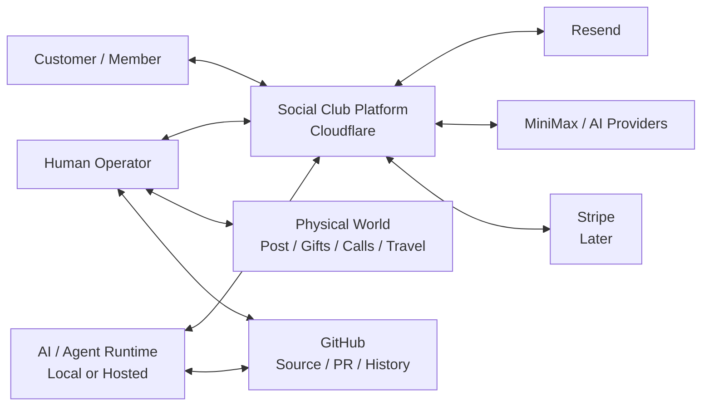
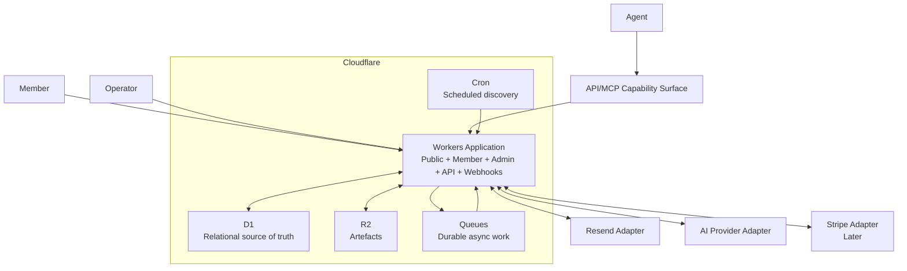
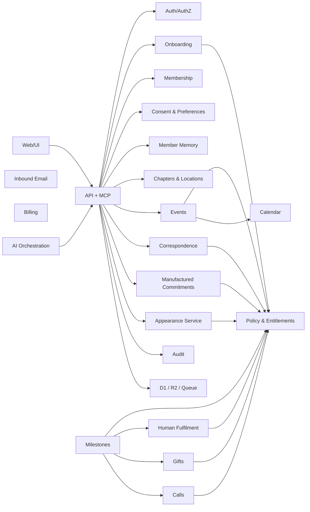

# 5. System Architecture — C4

## 5.1 Architectural rule

> Humans and AI are actors. Cloudflare is the system of record. APIs define capabilities. MCP exposes selected capabilities safely to agents. Queues represent durable work. Cron represents time. Resend represents correspondence. No actor is trusted to remember state that belongs to the system.

## 5.2 C4 Level 1 — System Context



## 5.3 C4 Level 2 — Containers



## 5.4 Modular monolith

Start with one coherent deployable Workers application exposing fetch/web routes, API/MCP, webhooks, queue consumer and scheduled handler where supported by chosen framework/entry architecture.

Do not start with a swarm of microservices.

## 5.5 C4 Level 3 — Logical Components



## 5.6 Worker responsibilities

- public site;
- waiting list;
- member portal;
- admin;
- API/MCP;
- Resend webhook;
- Stripe webhook later;
- queue handlers;
- scheduled handler;
- protected artefact delivery.

## 5.7 D1

Canonical relational source of business truth.

## 5.8 R2

Stores:

- images;
- letters;
- PDFs;
- cards;
- certificates;
- public brand assets;
- private member artefacts.

Private artefacts require authorised access, not permanent world-readable URLs.

## 5.9 Queues

Logical jobs:

```text
GENERATE_TEXT
GENERATE_IMAGE
RENDER_ARTIFACT
SEND_EMAIL
PROCESS_INBOUND_EMAIL
CREATE_MILESTONE_ACTIONS
CREATE_HUMAN_TASK
RESEARCH_LOCATION
EVENT_HEALTH_CHECK
AI_AGENT_WORK
```

All side-effecting jobs need idempotency.

## 5.10 Cron

Cron discovers due work and enqueues bounded jobs. It does not synchronously perform huge AI/email batches.

## 5.11 Environment model

Do not add `APP_ENV`.

Local, preview and production differ through real URLs, bindings, credentials and provider modes.

## 5.12 Local development

Cloudflare current documentation supports local Worker execution via `workerd`/Miniflare and local simulations for D1, R2 and Queues. Use them for integration/acceptance tests.

## 5.13 Public canonical URL

`https://club.loftwah.com`

Needed for generated absolute links from queues/Cron that have no incoming HTTP origin.

## 5.14 GitHub role

Source, specification, issues, PRs, history, release tags and minimal independent verification. Not part of customer runtime.

---
