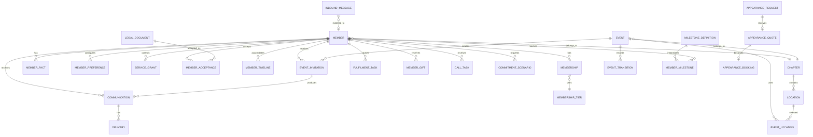

# 6. Data Model and ERD

## 6.1 Conceptual ERD



## 6.2 Suggested table groups

### Acquisition

```text
waitlist_entries
referrals
```

### Membership

```text
members
member_profiles
member_addresses
memberships
membership_tiers
member_preferences
member_service_grants
member_timeline
```

### Legal/consent

```text
legal_documents
member_acceptances
consent_events
```

### Member memory

```text
member_facts
member_fact_candidates
member_fact_restrictions
```

### Geography

```text
chapters
regions
locations
location_tags
location_verifications
```

### Events

```text
events
event_locations
event_invitations
event_transitions
event_calendar_messages
```

### Communications

```text
communications
communication_deliveries
inbound_messages
inbound_attachments
communication_templates
```

### Milestones/fulfilment

```text
milestone_definitions
member_milestones
fulfilment_tasks
physical_artifacts
gifts
member_gifts
calls
```

### Optional services

```text
commitment_scenarios
appearance_requests
appearance_quotes
appearance_bookings
```

### Billing

```text
billing_customers
subscriptions
payments
refunds
billing_events
```

### Fictional institution

```text
fictional_people
club_lore
club_history
journal_articles
```

### System

```text
ai_generations
jobs
idempotency_records
audit_log
system_events
```

## 6.3 Member facts

Conceptual fields:

```text
id
member_id
category
subject
value_json
status
source_type
source_id
confidence
do_not_use
created_at
updated_at
```

Statuses:

```text
CANDIDATE
CONFIRMED
REJECTED
REVOKED
```

AI may propose candidates. Confirmed truth follows deterministic source/confirmation policy.

## 6.4 Service grants

```text
CORE_MEMBERSHIP
NEWSLETTER
PERSONALISED_MEMORY
CALENDAR_MESSAGES
PHYSICAL_CORRESPONDENCE
GIFTS
CALLS
MANUFACTURED_COMMITMENTS
APPEARANCE_INTEREST
```

States:

```text
AVAILABLE
OPTED_IN
OPTED_OUT
INELIGIBLE
PAUSED
SUSPENDED
```

## 6.5 Entitlements

Do not hard-code price checks. Use capability mapping.

Capabilities can include:

```text
EVENTS
NEWSLETTER
MEMBER_MEMORY
DIGITAL_BIRTHDAY
PHYSICAL_WELCOME
PHYSICAL_CORRESPONDENCE
MILESTONE_ARTEFACT
MANUFACTURED_COMMITMENTS
GIFTS
CALLS
PREMIUM_HUMAN_ATTENTION
APPEARANCE_MEMBER_BENEFIT
```

## 6.6 Event fields

At minimum:

```text
id
chapter_id
title
event_type
start_at
duration_minutes
cancellation_due_at
state
created_by_actor
created_at
updated_at
cancelled_at
archived_at
```

## 6.7 Jobs

```text
job_id
type
entity_type
entity_id
payload_version
priority
attempt
idempotency_key
available_at
claimed_until
created_at
completed_at
failure_reason
```

## 6.8 Audit

```text
id
actor_type
actor_id
action
entity_type
entity_id
from_state
to_state
reason_code
correlation_id
metadata_json
created_at
```

## 6.9 Fictional vs real

Fictional Society characters/lore must be explicitly stored/labelled as fictional institutional content, not inserted into real member tables.

---
