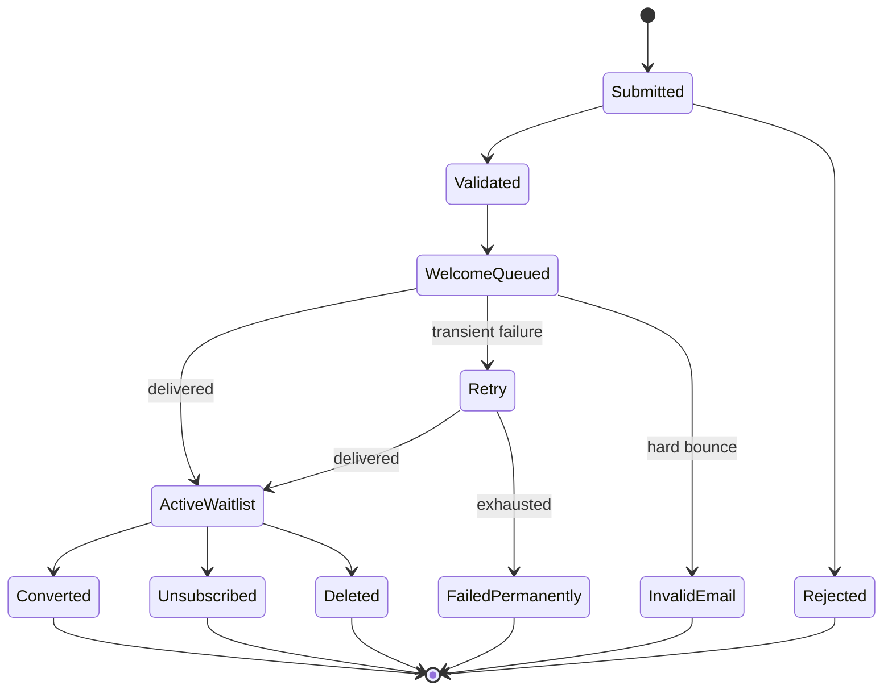
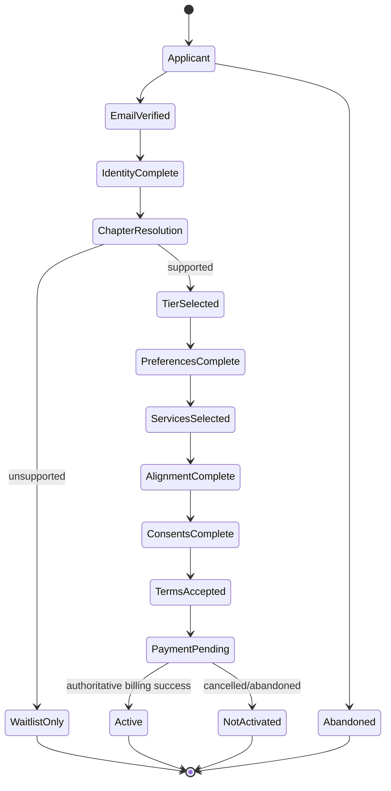
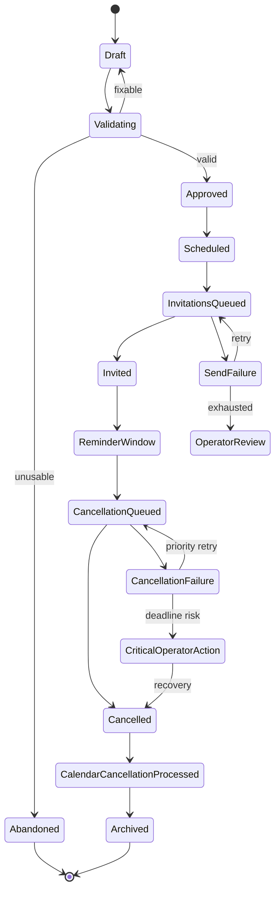
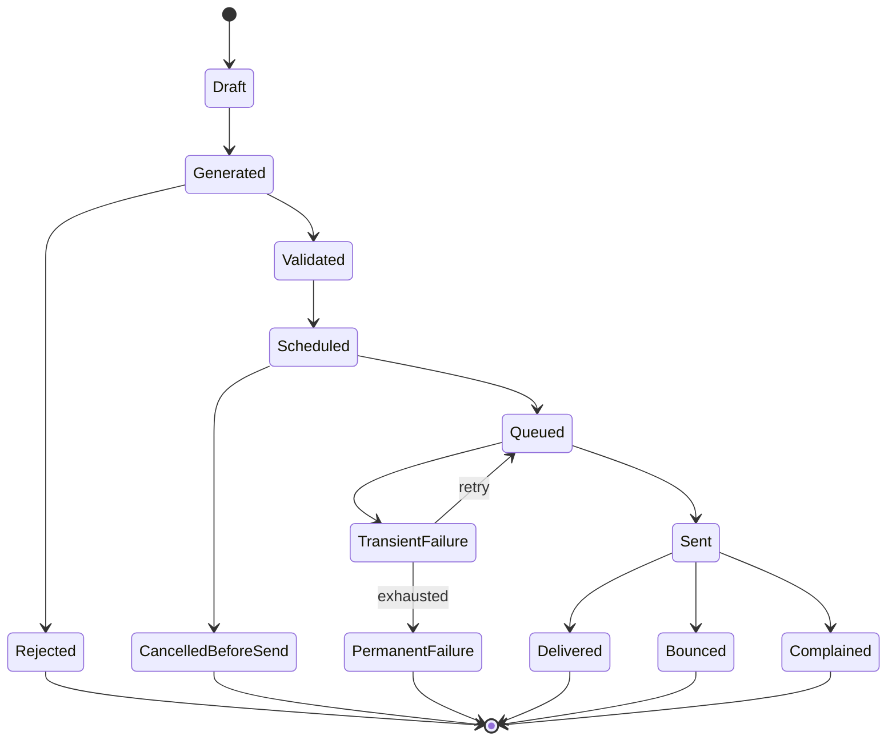
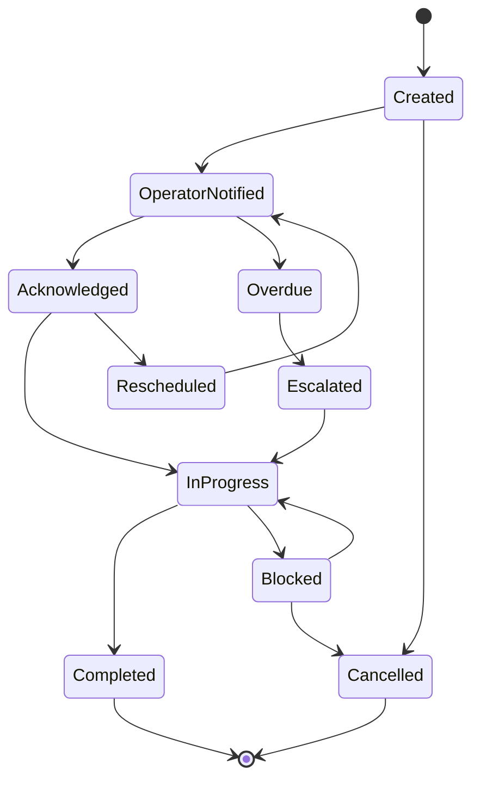
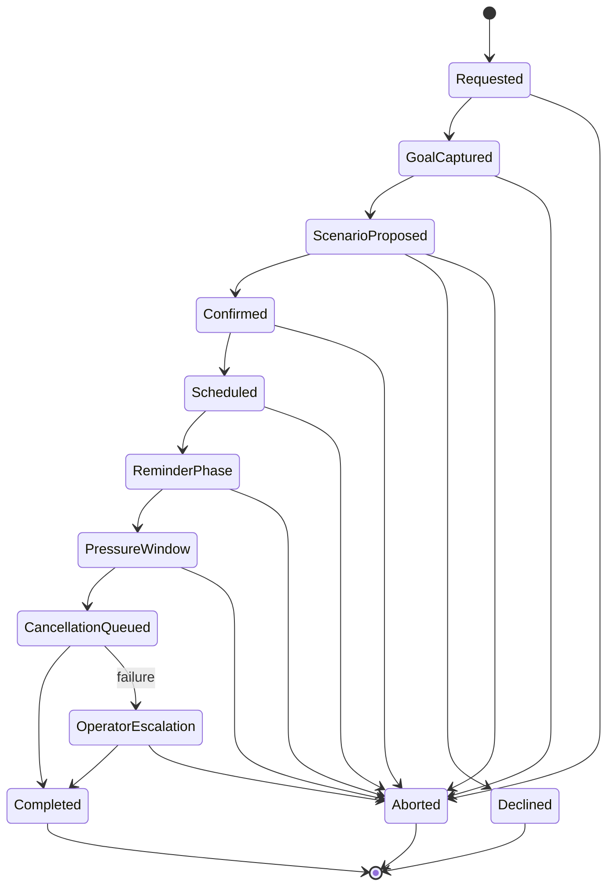
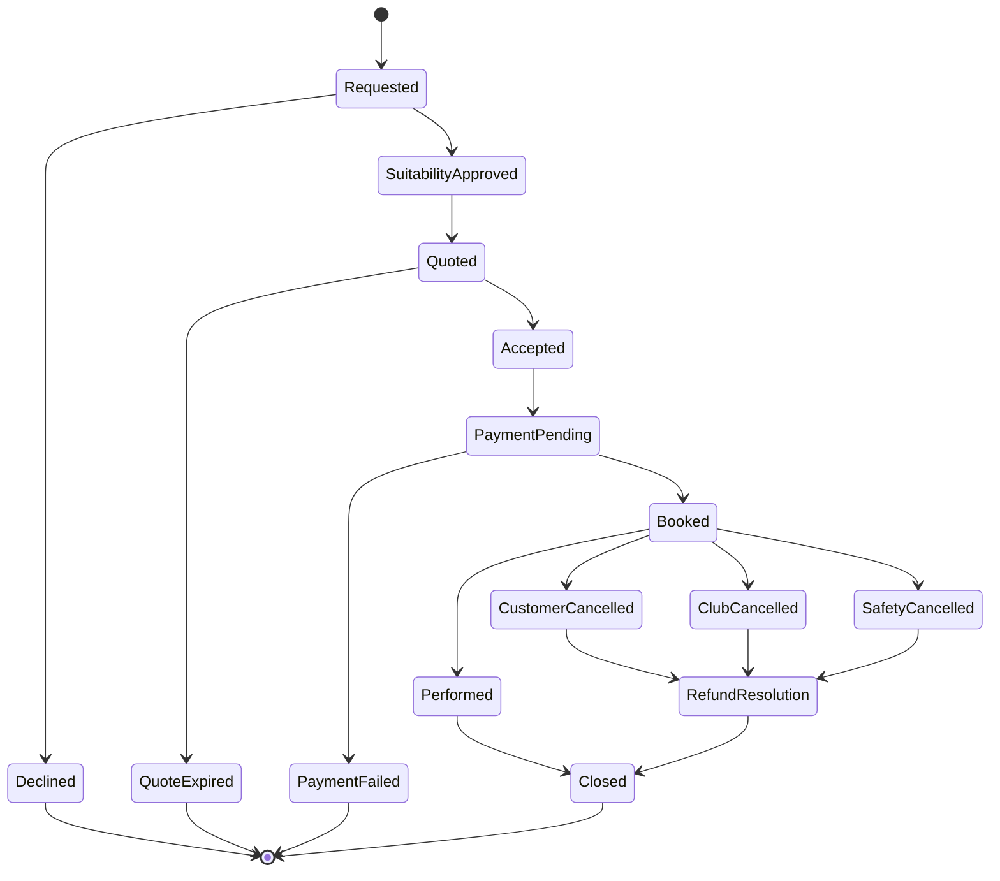

# 7. State Machines

## 7.1 Waitlist



## 7.2 Paid onboarding



## 7.3 Membership standing

```text
ACTIVE
→ PAST_DUE → ACTIVE | CANCELLED
ACTIVE → CANCELLED
CANCELLED → ACTIVE on rejoin
ACTIVE → SUSPENDED → ACTIVE
```

Deletion is separate.

## 7.4 Ordinary event



Forbidden ordinary-event states:

```text
ATTENDED
CHECKED_IN
NO_SHOW
```

## 7.5 Communication



## 7.6 Inbound email

```text
RECEIVED
→ SIGNATURE_VERIFIED
→ STORED
→ MATCHED | UNMATCHED
→ CLASSIFIED
→ AUTO_HANDLED | HUMAN_REVIEW | SAFE_NO_ACTION
→ CLOSED
```

Failures:

```text
INVALID_SIGNATURE → REJECTED
DUPLICATE → ACKNOWLEDGED_NOOP
MALFORMED → QUARANTINED/REJECTED
PROCESSING_FAILURE → RETRY → HUMAN_REVIEW/PERMANENT_FAILURE
```

## 7.7 Human fulfilment



## 7.8 Gift

```text
TRIGGERED
→ ELIGIBILITY_CHECK
  → NOT_ELIGIBLE → CLOSED
  → MEMBER_OPTED_OUT → CLOSED
  → BUDGET_DENIED → ALTERNATIVE/CLOSED
  → ELIGIBLE
→ SUGGESTED
→ HUMAN_APPROVED
→ PURCHASED
→ DISPATCHED
→ DELIVERED
```

Exceptions terminate through retry, alternative, replacement or closure.

## 7.9 Call

```text
PROPOSED
→ POLICY_ALLOWED | DENIED
→ SCHEDULED
→ DUE
→ COMPLETED
```

Branches:

```text
PERMISSION_REVOKED → CANCELLED
MEMBER_CANCELLED → CANCELLED
NO_ANSWER → RESCHEDULED/CLOSED according to policy
```

## 7.10 Manufactured commitment



## 7.11 Appearance service



## 7.12 Deletion

```text
REQUESTED
→ ACTIVITY_SUSPENDED
→ FUTURE_JOBS_CANCELLED
→ PERSONAL_DATA_DELETION
→ REQUIRED_RETENTION_SEPARATED
→ DELETED
```

## 7.13 State-machine test rule

Every state must have a documented outgoing path unless terminal. Every failure must retry, close or escalate. Invalid transitions are tested.

---
