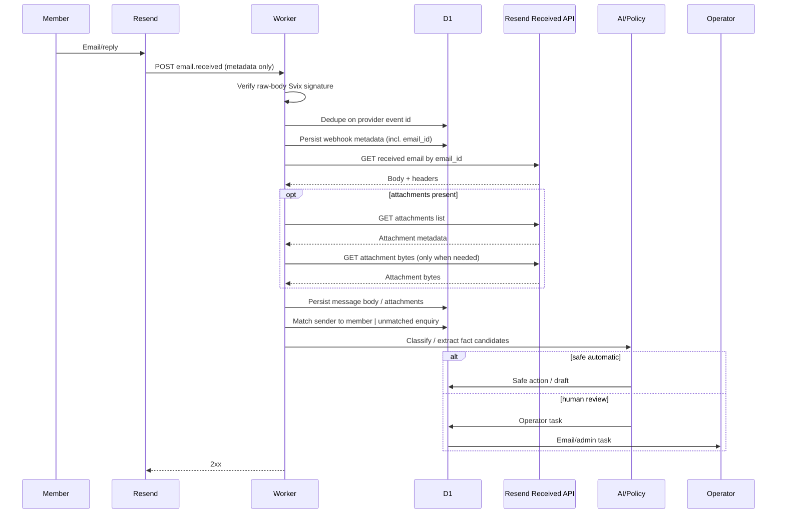
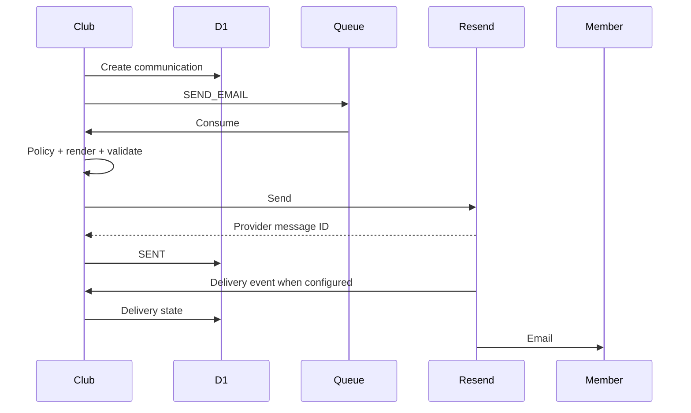

# 9. Resend, Email and Calendar

## 9.1 Correct current environment names

```text
RESEND_API_KEY
RESEND_WEBHOOK_ID
RESEND_WEBHOOK_SIGNING_SECRET
RESEND_FROM
OPERATOR_EMAIL
```

Do not use `RESEND_WEBHOOK_SECRET`.

## 9.2 Locked webhook

```text
POST https://club.loftwah.com/api/webhooks/resend
```

Initial event:

```text
email.received
```

## 9.3 Verified current Resend facts

Current Resend documentation verifies:

- webhook-management API exists;
- create returns webhook `id`;
- create returns `signing_secret`;
- signing secret is `whsec_...`;
- verification uses raw request body;
- current verification example uses `svix-id`, `svix-timestamp`, `svix-signature` headers;
- inbound mail uses `email.received`.

Re-check official docs at implementation time.

## 9.4 Webhook creation command

Only if no webhook exists:

```bash
curl -sS https://api.resend.com/webhooks \
  -H "Authorization: Bearer $RESEND_API_KEY" \
  -H "Content-Type: application/json" \
  -d '{
    "endpoint": "https://club.loftwah.com/api/webhooks/resend",
    "events": ["email.received"]
  }'
```

Expected response includes:

```json
{
  "object": "webhook",
  "id": "...",
  "signing_secret": "whsec_..."
}
```

Store returned values as:

```text
RESEND_WEBHOOK_ID
RESEND_WEBHOOK_SIGNING_SECRET
```

The current project reports the real environment already has both values. Do not blindly create a duplicate webhook.

## 9.5 Verification pseudocode

Verify current SDK before coding exact syntax:

```text
rawBody = request raw text
headers = svix-id + svix-timestamp + svix-signature
verified = Resend verify(rawBody, headers, RESEND_WEBHOOK_SIGNING_SECRET)
invalid → 400, no business processing
```

Do not parse/re-serialise before signature verification.

## 9.6 Inbound sequence

The `email.received` webhook is **metadata only**. It does not contain the email body, headers or attachment bytes. The Worker must verify the raw body, persist the metadata, then call the Resend Received Emails API by `email_id` to obtain the message body and headers, and the Attachments API to obtain attachment metadata and bytes when needed.



Inbound endpoints used (verify current Resend SDK shape at implementation time):

- `resend.emails.receiving.get(email_id)` — body and headers for a received message
- `resend.emails.receiving.attachments.list({ emailId })` — list of attachment metadata
- `resend.emails.receiving.attachments.get({ emailId, attachmentId })` — attachment bytes (only when actually required)

The body fetch is idempotent; results are cached/persisted in D1 keyed by `email_id` and (if available) provider-side `received_at` so re-processing the same `email_id` does not re-classify indefinitely.

## 9.7 Inbound address/domain

Receiving address is separate from webhook verification.

Resend provides a managed inbound address (`<alias>@<id>.resend.app`) that requires no DNS for development. A custom receiving domain requires DNS/MX setup.

Default development strategy: use the managed Resend inbound address while integrating. Migrate to a dedicated subdomain such as `inbound.club.loftwah.com` (single MX record on the `inbound` host at priority 10) only when real inbound traffic is needed.

Do not alter root `loftwah.com` MX records without explicit instruction. A receiving subdomain on `club.loftwah.com` is acceptable; touching the apex `loftwah.com` zone is not.

## 9.8 Outbound sequence



## 9.9 Email classes

```text
WAITLIST_WELCOME
MEMBERSHIP_WELCOME
MEMBERSHIP_ANNIVERSARY
EVENT_INVITATION
EVENT_REMINDER
EVENT_CANCELLATION
BIRTHDAY
PERSONAL_CORRESPONDENCE
CHAPTER_LETTER
NEWSLETTER
FULFILMENT_NOTIFICATION
ADMIN_TASK
ADMIN_ESCALATION
BILLING
PRIVACY
```

## 9.10 Calendar

MVP uses standards-based calendar messages/attachments, not member OAuth.

Every event has stable UID, conceptually:

```text
event-<uuid>@club.loftwah.com
```

Invitation and cancellation must use standards-compliant semantics and same UID.

Verify iCalendar specifics at implementation time and test actual Apple Calendar, Google Calendar and Outlook behaviour.

## 9.11 Email failure

Transient → retry.

Permanent → operator visibility.

Cancellation close to deadline → critical priority/escalation.

Calendar failure must not prevent plain email cancellation.

Official Resend references:

- https://resend.com/changelog/managing-webhooks-via-api
- https://resend.com/features/inbound
- https://resend.com/blog/inbound-emails

---
